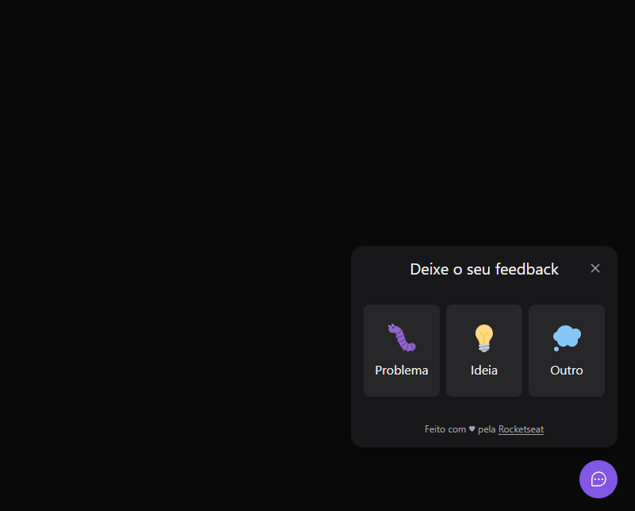

# NLW Return Web 2022

O NLW Return Web 2022 é um projeto desenvolvido durante o evento NLW Return da Rocketseat. Trata-se de um botão flutuante que permite aos usuários fornecer feedbacks, incluindo relatos de problemas, sugestões de melhorias e outras observações.

Acesse o projeto aqui: [NLW Return Web 2022](https://nlw-return-web-2022.vercel.app/)

### Recursos

- **Botão Flutuante:** Interface amigável com um botão flutuante que facilita o acesso dos usuários para fornecer feedbacks.
- **Formulário de Feedback:** Formulário interativo que permite aos usuários enviar feedbacks de forma rápida e intuitiva.
- **Integração com API:** Integração com a API do projeto [NLW Return Server 2022](https://github.com/thiag-o/nlw-return-server-2022.git), que armazena e processa os feedbacks recebidos dos usuários.
- **Estilização com CSS:** Aplicação de estilos CSS para tornar a interface visualmente atraente e responsiva.

### Instruções de Uso

Dependências: Node 14.17.0

1. Clone este repositório em sua máquina local `git clone https://github.com/thiag-o/nlw-return-web-2022.git`.
2. Instale as dependências do projeto utilizando `npm install` ou `yarn install`.
3. Inicie o servidor de desenvolvimento executando `npm run dev` ou `yarn dev`.
4. Acesse o aplicativo através do navegador utilizando o endereço `http://localhost:3000`.
5. Utilize o botão flutuante para acessar o formulário de feedback e compartilhar suas observações.

## Tecnologias

## Licença

[MIT](https://choosealicense.com/licenses/mit/)
